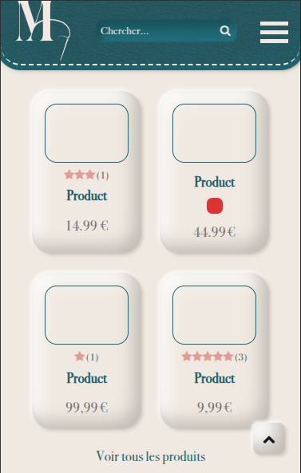
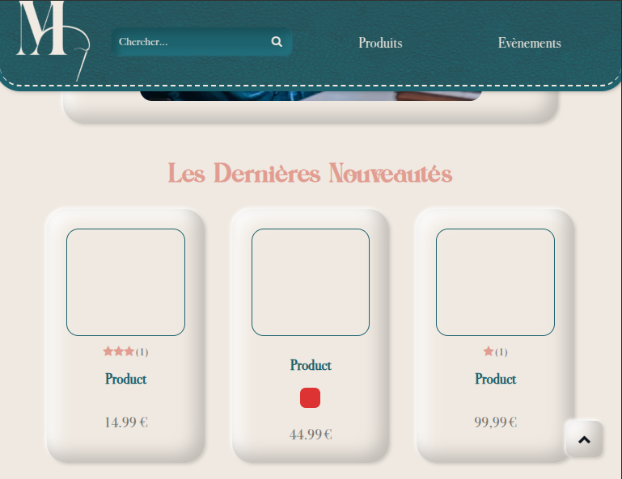
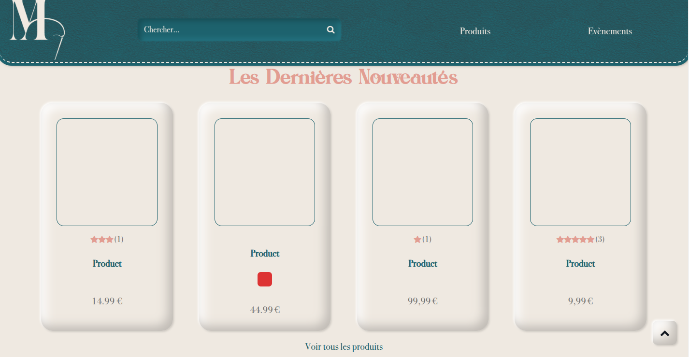

# Maison Alibert's Website

This repository contains the code for the [Maison Alibert](https://maisonalibert.fr/) website, an online platform dedicated to the world of saddlery and leather goods craftsmanship. The website serves as a digital gateway, allowing visitors to explore Maison Alibert’s heritage, expertise, and custom-made creations.

## Table of Contents
- [Maison Alibert's Website](#maison-aliberts-website)
  - [Table of Contents](#table-of-contents)
  - [Introduction](#introduction)
  - [Features](#features)
  - [Pages](#pages)
  - [Technologies Used](#technologies-used)
  - [Installation](#installation)
  - [Usage](#usage)
  - [Screenshots](#screenshots)
    - [Mobile Version](#mobile-version)
    - [Tablet Version](#tablet-version)
    - [Desktop Version](#desktop-version)
  - [Contact](#contact)
  - [Credits](#credits)

## Introduction
Maison Alibert is an artisanal workshop specializing in the creation, restoration, and crafting of high-quality leather goods. This website serves as its online showcase, providing customers with an immersive look into the artistry, craftsmanship, and unique designs that define Maison Alibert.

## Features
- **Homepage**: A visually engaging introduction to Maison Alibert’s heritage, showcasing its latest products, a call-to-action for visitors to explore further, and a section highlighting the artisanal techniques used in leatherworking.
- **Product Pages**: A dedicated section displaying the full range of Maison Alibert’s handcrafted products, featuring pagination for easy navigation, category filtering, and sorting options by date or price. The filtering and sorting functionalities remain persistent even when navigating through paginated pages.
- **Product Detail Pages**: Individual product pages offering high-quality images, available colors, detailed descriptions, pricing information, and a review system allowing customers to share feedback via star ratings. The review system includes nested comments, displaying total reviews, average ratings, and a breakdown of customer opinions.
- **Events Page**: A section listing upcoming events featuring Maison Alibert, including event names, dates, locations, and entry fees.

## Pages
1. **Homepage**: Introduction to Maison Alibert, latest products, and craftsmanship details.
2. **Products**: Full product catalog with filtering, sorting, and pagination.
3. **Product Detail**: In-depth product descriptions, customer reviews, and ratings.
4. **Events**: Information on upcoming events featuring Maison Alibert.

## Technologies Used
- HTML
- SCSS
- JavaScript
- PHP
- MySQL
- WordPress
- NPM
- YoastSEO
- Advanced Custom Fields
- Webpack
- Composer

## Installation
1. Ensure that you have Composer, NPM, and Webpack installed on your system.
2. Clone the repository.
3. Navigate to the project directory in your terminal.
4. Run `composer install` to install WordPress, plugins, and themes.
5. Set up your MySQL database.
6. Update the database connection details in the `wp-config.php` file (use a copy of `wp-config-sample.php`).
7. Navigate to the theme directory in your terminal.
8. Run `npm install` to install dependencies.

## Usage
1. Configure the WordPress back-office to dynamically manage content.
2. Customize theme settings and content to align with Maison Alibert’s branding and products.
3. **This code is provided as an example of our capabilities and may not be hosted online or used for commercial purposes without the explicit consent of both Maison Alibert and XiaoDev.**

## Screenshots
Here are some previews of the website on different devices:

### Mobile Version

### Tablet Version

### Desktop Version

## Contact
For inquiries regarding this project, please reach out via email:  
📩 contact@xiaodev.fr

## Credits
The Maison Alibert's Website was created and maintained by XiaoDev.

---
If you have any questions or feedback, please [reach out](mailto:&#99;o&#110;&#116;%61%63t&#64;&#120;&#105;a&#111;&#100;%65%76%2e&#102;%72).